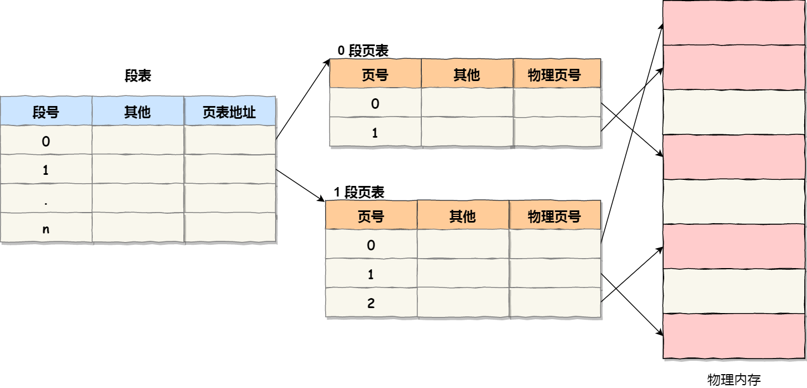

# 内存管理
## 1. 虚拟内存
1.1 对于没有操作系统的硬件系统，如单片机，通常都是将程序直接烧录在指定的地址，然后CPU直接操作内存的【物理地址】  
1.2 对于这种情况，不能够同时存放两个程序，否则会出现第二个程序覆盖第一个程序的情况  
1.3 为了避免直接引用绝对物理地址，把进程使用的地址隔离开来，进程之间不会互相影响，于是让操作系统为每个进程分配一套独立的【虚拟地址】，进程与进程之间互不干涉，  
1.4 **操作系统会提供一种机制，将不同的进程的虚拟地址和不同内存地址映射起来**  
1.5 在程序访问虚拟地址的时候，操作系统会将其转换成不同的物理地址，这样就不会导致进程之间的地址冲突  
1.6 于是就引出了两个地址概念：
- 程序使用的内存地址：【虚拟内存地址】
- 实际硬件的内存地址：【物理内存地址】
1.7 对于操作系统引入的虚拟内存地址，进程持有的虚拟地址会被CPU通过MMU（内存管理单元）映射到对于的物理地址，接着访问对于的物理内存  

## 2. 内存分段
2.1 由于引入了虚拟内存地址，那么操作系统如何管理虚拟内存与物理地址之间的关系呢？  
2.2 有两种：内存分段和内存分页。首先是较早提出的内存分段  
2.3 内存分段：
- 首先程序是由若干逻辑分段组成的，如代码段、数据段、堆段、栈段，因此可以使用分段（segmenttation）的形式把段分离开
- 分段机制下的虚拟地址由两部分组成：【段选择因子】和【段偏移】

- 段选因子保存在寄存器中，段选择因子里面最主要的是段号，作为段表索引段表保存了这个段的基地址、段界限和特权等级
- 虚拟地址的段偏移应该处于段表0到段界限之间，如果段偏移合法，则通过段基地址加上段偏移得到物理地址

- 通过段表和和物理地址的映射，分段机制把程序分为4个段如果要访问段3的偏移500虚拟地址，段3基地址7000+偏移500=0x7500

2.4 分段的问题

- 分段会产生内存碎片

- 分段的内存交换效率很低

假设1g内存，游戏占512M，浏览器占128M，音乐占256M，此时我们关闭浏览器，则空闲内存=1024-512-256=256，但是由于256M内存不连续，此时我们想要打开一个内存占用为200的程序，会出现内存不足的情况。

在这个例子中，有两处内存碎片的问题：

- 外部碎片：即产生了多个不连续的小内存块，导致新的程序无法被装载
- 内部碎片：程序被完整的装载到内存中，但是部分程序可能是不会被访问到的，这也会导致内存的浪费

**内存碎片解决办法**

- 内存交换，也就是把音乐程序的256M内存写回硬盘，然后再把程序读出来紧挨着游戏的512M装载，这样可以获得连续的256M空闲内存。这个内存交换空间，在Linux中也就是我们装系统时从硬盘选择出的swap空间大小。

**交换效率低下的问题**

- 对多进程而言，为了解决内存碎片不得不进行内存交换，这个过程会产生性能瓶颈
- 原因是硬盘的访问速度远小于内存的访问速度，因此这个过程会导致机器变得很卡顿

## 3. 内存分页

3.1 为了解决内存分段造成的内存碎片和内存交换效率低下的问题，出现了内存分页

3.2 分页是把整个虚拟和物理地址空间切成一段段固定尺寸的大小。这样一个连续并且尺寸固定的内存空间称为【页】，在Linux中一个大小是4KB

3.3 虚拟地址和物理地址之间通过页表来映射。页表存储在内存中，内存管理单元MMU负责将虚拟地址转换成物理地址。

当进程访问的虚拟地址在页表中查不到时，系统产生一个缺页异常，进入系统内核空间进行物理内存分配更新进程页表，最后返回用户空间，恢复进程的运行。

3.4 分页解决问题的思路

- 由于内存空间都是预先划分好的，不会像分段那样产生间隙很小的内存，，解决了内存分段的碎片问题
- 由于采用了分页机制，那么释放内存就是以页为单位而不是以程序为单位，也就不会产生无法给进程使用的小内存
- 当内存不够时，操作系统会吧其他正在运行的进程中【最近没有被使用】的内存页释放，也就是暂时写回硬盘即【换出】，等到下次需要时再加载进来，这样称为【换入】。
- 通过这样以页为单位的换入和换出操作，减少了磁盘的读写量，提高内存交换的效率
- 更进一步来说，分页的方式使得我们加载程序时，不需要一次性把程序完整的加载到内存中，只有在需要用到对应的虚拟内存时才把其加载到物理内存中去

3.5 分页机制的虚拟地址到物理地址的映射

分页机制，虚拟地址分为两个部分，【页号】+【页内偏移】。页号作为页表的索引，页表包含物理页每页所在物理内存的地址，这个基地址与段内偏移的组合就形成了物理内存地址

三个步骤：

- 把虚拟内存地址，切分为页号和偏移量
- 根据页号，从页表里面查询物理页号
- 直接拿物理页号，加上偏移量，得到最终的物理地址

3.6 简单分页的缺陷

**空间缺陷**：进程多的话，产生的页表会非常庞大

例如，一个32位的机器，虚拟内存为4G，假设一个页大小4KB，那就需要2^20约100万个页，每个页表项4字节存储的话，那么每个进程就需要4MB的内存来存储页表。

假设100个进程那么就需要400MB内存，再到64位系统就更加夸张

3.7 多级页表

由于页表项占用的内存较大，为此引入了多级页表。对于前面的一级页表，我们将1024个一级页表又合为一个页表，即二级页表。

此时，一个进程的页表内存占用为4K+4MB，虽然占用的内存变大了，但是往往一个进程不会分配这么大的内存，结合程序的局部性原理，大多数情况下，部分页表是空的，那么我们完全没有必要去分配物理内存，将其放在硬盘即可。

如果使用了二级分页，一级页表就可以覆盖整个 4GB 虚拟地址空间，但**如果某个一级页表的页表项没有被用到，也就不需要创建这个页表项对应的二级页表了，即可以在需要时才创建二级页表**。做个简单的计算，假设只有 20% 的一级页表项被用到了，那么页表占用的内存空间就只有 4KB（一级页表） + 20% * 4MB（二级页表）= `0.804MB`，这对比单级页表的 `4MB` 是一个巨大的节约

那么为什么不分级的页表就做不到这样节约内存呢？我们从页表的性质来看，保存在内存中的页表承担的职责是将虚拟地址翻译成物理地址。假如虚拟地址在页表中找不到对应的页表项，计算机系统就不能工作了。所以**页表一定要覆盖全部虚拟地址空间，不分级的页表就需要有 100 多万个页表项来映射，而二级分页则只需要 1024 个页表项**（此时一级页表覆盖到了全部虚拟地址空间，二级页表在需要时创建）。

将二级页表推广到多级页表，则内存占用会更低，这归功于程序的局部性原理

对于64位系统，又两级分页变为了四级分页：

- 全局页目录项PGD（Page Global Directory）
- 上层页目录PUD（Page Upper Directory）
- 中间页目录PMD（Page Middle Directory）
- 页表项PTE（Page Table Entry）

3.8 TLB

- 为了减少内存的开销，引入了多级页表，但是这也将虚拟地址到物理地址的转换流程变得更加复杂，增加了转换的耗时。

- 又由于程序的局部性原理，在一段时间内，整个程序的执行仅限于程序的某一个部分。相应的执行所访问的存储空间也局限于某个内存区域

- 利用这一特性，将经常访问的几个页表项存储到访问速度快的硬件上，为此CPU中加入了一个专门存放程序最常访问的页表项的cache，称为TLB（translation Lookaside Buffer），即页表缓存、转址旁路缓存，块表等

- 在CPU芯片中，封装了MMU来完成地址转换和TLB的访问与交互。CPU在寻址时首先查TLB，如果TLB没有找到则继续查常规页表
- TLB的命中率很高，因为程序最常访问的也就那么几个

## 4. 段页式内存管理

4.1 内存分段和分页并不对立，可以组合起来在同一个系统中使用，组合后称为段页式内存管理

4.2 段页式内存管理实现方法

- 先将程序划分为多个有逻辑意义的段，即前面说的分段机制
- 接着把每个段划分为多个页，也就是分队划分出来的连续空间，再划分为固定大小的页

这样，地址结构就由【段号+段内页号+页内偏移】三部分构成

用于段页式地址变换的数据结构是每一个程序一张段表，每个段又建立一张页表，段表中的地址是页表的起始地址，而页表中的地址是某页的物理地址

段页式地址转换得到物理地址要经过三次内存访问：

- 第一次访问段表，得到页表起始地址
- 第二次访问页表得到物理页号
- 第三次将物理页号与页内偏移结合得到物理地址

通过软硬件结合的方式实现段页式地址变换，虽然增加了硬件成本和系统开销，但是提高了内存的利用率

## 5. Linux内存管理 

5.1 Intel处理器发展史

早期 Intel 的处理器从 80286 开始使用的是段式内存管理。但是很快发现，光有段式内存管理而没有页式内存管理是不够的，这会使它的 X86 系列会失去市场的竞争力。因此，在不久以后的 80386 中就实现了页式内存管理。也就是说，80386 除了完成并完善从 80286 开始的段式内存管理的同时还实现了页式内存管理。

但是这个 80386 的页式内存管理设计时，没有绕开段式内存管理，而是建立在段式内存管理的基础上，这就意味着，**页式内存管理的作用是在由段式内存管理所映射而成的地址上再加上一层地址映射。**

由于此时由段式内存管理映射而成的地址不再是“物理地址”了，Intel 就称之为“线性地址”（也称虚拟地址）。于是，段式内存管理先将逻辑地址映射成线性地址，然后再由页式内存管理将线性地址映射成物理地址。

这里说明下逻辑地址和线性地址：

- 程序所使用的地址，通常是没被段式内存管理映射的地址，称为逻辑地址；
- 通过段式内存管理映射的地址，称为线性地址，也叫虚拟地址；

逻辑地址是「段式内存管理」转换前的地址，线性地址则是「页式内存管理」转换前的地址。

5.2 Linux内存管理

**Linux 内存主要采用的是页式内存管理，但同时也不可避免地涉及了段机制**。

这主要是上面 Intel 处理器发展历史导致的，因为 Intel X86 CPU 一律对程序中使用的地址先进行段式映射，然后才能进行页式映射。既然 CPU 的硬件结构是这样，Linux 内核也只好服从 Intel 的选择。

但是事实上，Linux 内核所采取的办法是使段式映射的过程实际上不起什么作用。也就是说，“上有政策，下有对策”，若惹不起就躲着走。

**Linux 系统中的每个段都是从 0 地址开始的整个 4GB 虚拟空间（32 位环境下），也就是所有的段的起始地址都是一样的。这意味着，Linux 系统中的代码，包括操作系统本身的代码和应用程序代码，所面对的地址空间都是线性地址空间（虚拟地址），这种做法相当于屏蔽了处理器中的逻辑地址概念，段只被用于访问控制和内存保护。**

5.3 Linux虚拟地址空间分布

- 在 Linux 操作系统中，虚拟地址空间的内部又被分为**内核空间和用户空间**两部分，不同位数的系统，地址空间的范围也不同。比如最常见的 32 位和 64 位系统，如下所示：

- 可以看出
  - `32` 位系统的内核空间占用 `1G`，位于最高处，剩下的 `3G` 是用户空间；
  - `64` 位系统的内核空间和用户空间都是 `128T`，分别占据整个内存空间的最高和最低处，剩下的中间部分是未定义的。

- 用户空间和内核空间的区别：

  - 进程处于用户态，只能访问用户空间内存
  - 只有进入内核态，才可以访问内核空间的内存

- 每个进程的都有各自独立的虚拟内存，但是虚拟内存中的内核地址对应的物理地址都是相同的
  

- 用户空间分布，以32位为例
  

- 通过上面这张图可以看到，用户空间内存，从**低到高**分别是 6 种不同的内存段：

  - 程序文件段（.text），包括二进制可执行代码；
  - 已初始化数据段（.data），包括静态常量；
  - 未初始化数据段（.bss），包括未初始化的静态变量；
  - 堆段，包括动态分配的内存，从低地址开始向上增长；
  - 文件映射段，包括动态库、共享内存等，从低地址开始向上增长（[跟硬件和内核版本有关 (opens new window)](http://lishiwen4.github.io/linux/linux-process-memory-location)）；
  - 栈段，包括局部变量和函数调用的上下文等。栈的大小是固定的，一般是 `8 MB`。当然系统也提供了参数，以便我们自定义大小；

  在这 7 个内存段中，堆和文件映射段的内存是动态分配的。比如说，使用 C 标准库的 `malloc()` 或者 `mmap()` ，就可以分别在堆和文件映射段动态分配内存。

## 6. malloc内存分配

