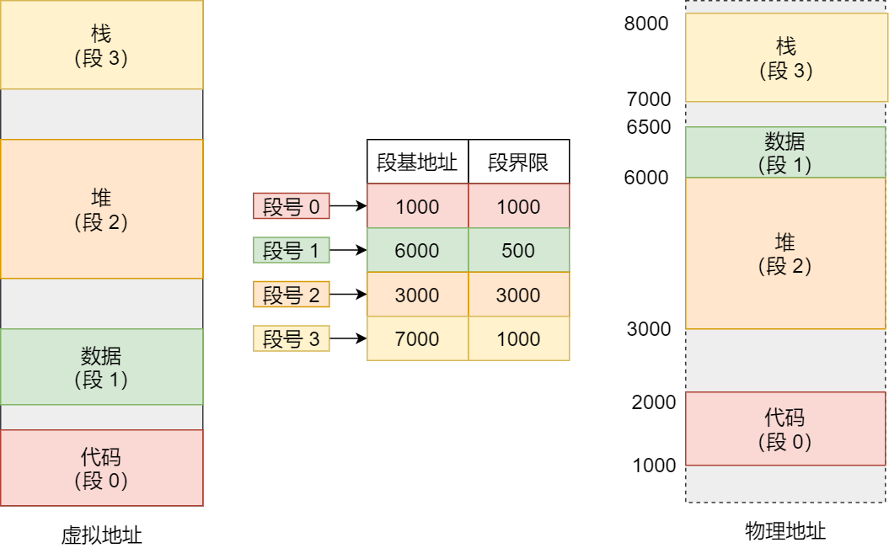
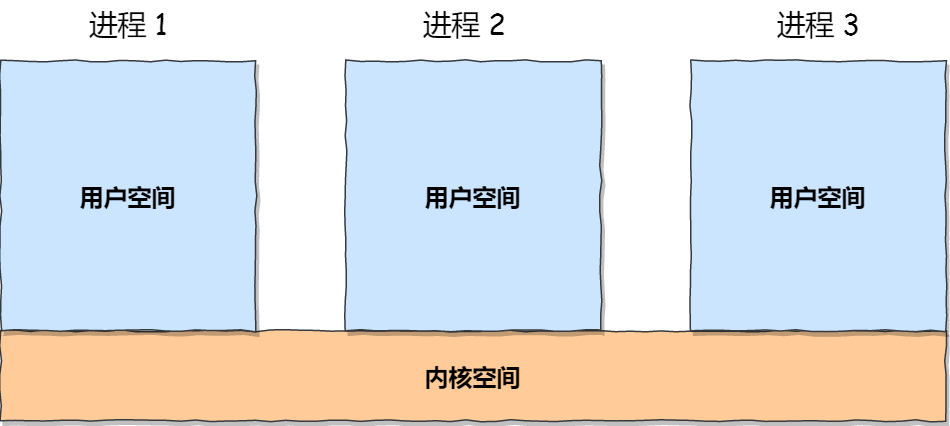
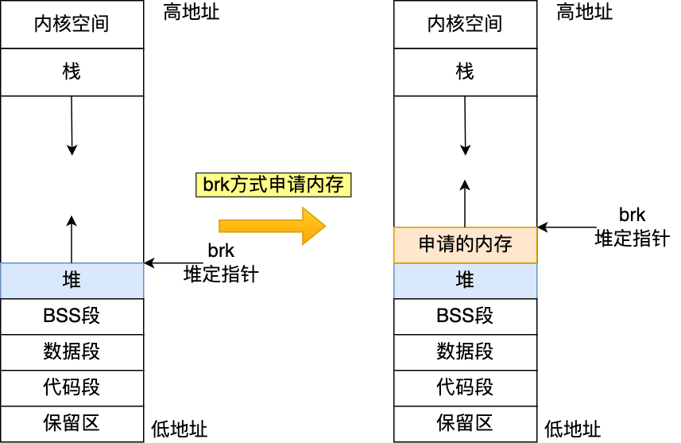

# 内存管理
## 1. 虚拟内存
1.1 对于没有操作系统的硬件系统，如单片机，通常都是将程序直接烧录在指定的地址，然后CPU直接操作内存的【物理地址】  
1.2 对于这种情况，不能够同时存放两个程序，否则会出现第二个程序覆盖第一个程序的情况  
1.3 为了避免直接引用绝对物理地址，把进程使用的地址隔离开来，进程之间不会互相影响，于是让操作系统为每个进程分配一套独立的【虚拟地址】，进程与进程之间互不干涉，  
1.4 **操作系统会提供一种机制，将不同的进程的虚拟地址和不同内存地址映射起来**  
1.5 在程序访问虚拟地址的时候，操作系统会将其转换成不同的物理地址，这样就不会导致进程之间的地址冲突  
1.6 于是就引出了两个地址概念：
- 程序使用的内存地址：【虚拟内存地址】
- 实际硬件的内存地址：【物理内存地址】
1.7 对于操作系统引入的虚拟内存地址，进程持有的虚拟地址会被CPU通过MMU（内存管理单元）映射到对于的物理地址，接着访问对于的物理内存  

## 2. 内存分段
2.1 由于引入了虚拟内存地址，那么操作系统如何管理虚拟内存与物理地址之间的关系呢？  
2.2 有两种：内存分段和内存分页。首先是较早提出的内存分段  
2.3 内存分段：
- 首先程序是由若干逻辑分段组成的，如代码段、数据段、堆段、栈段，因此可以使用分段（segmenttation）的形式把段分离开
- 分段机制下的虚拟地址由两部分组成：【段选择因子】和【段偏移】


- 段选因子保存在寄存器中，段选择因子里面最主要的是段号，作为段表索引段表保存了这个段的基地址、段界限和特权等级
- 虚拟地址的段偏移应该处于段表0到段界限之间，如果段偏移合法，则通过段基地址加上段偏移得到物理地址



- 通过段表和和物理地址的映射，分段机制把程序分为4个段如果要访问段3的偏移500虚拟地址，段3基地址7000+偏移500=0x7500

2.4 分段的问题

- 分段会产生内存碎片

- 分段的内存交换效率很低

假设1g内存，游戏占512M，浏览器占128M，音乐占256M，此时我们关闭浏览器，则空闲内存=1024-512-256=256，但是由于256M内存不连续，此时我们想要打开一个内存占用为200的程序，会出现内存不足的情况。


在这个例子中，有两处内存碎片的问题：

- 外部碎片：即产生了多个不连续的小内存块，导致新的程序无法被装载
- 内部碎片：程序被完整的装载到内存中，但是部分程序可能是不会被访问到的，这也会导致内存的浪费

**内存碎片解决办法**

- 内存交换，也就是把音乐程序的256M内存写回硬盘，然后再把程序读出来紧挨着游戏的512M装载，这样可以获得连续的256M空闲内存。这个内存交换空间，在Linux中也就是我们装系统时从硬盘选择出的swap空间大小。

**交换效率低下的问题**

- 对多进程而言，为了解决内存碎片不得不进行内存交换，这个过程会产生性能瓶颈
- 原因是硬盘的访问速度远小于内存的访问速度，因此这个过程会导致机器变得很卡顿

## 3. 内存分页

3.1 为了解决内存分段造成的内存碎片和内存交换效率低下的问题，出现了内存分页

3.2 分页是把整个虚拟和物理地址空间切成一段段固定尺寸的大小。这样一个连续并且尺寸固定的内存空间称为【页】，在Linux中一个大小是4KB

3.3 虚拟地址和物理地址之间通过页表来映射。页表存储在内存中，内存管理单元MMU负责将虚拟地址转换成物理地址。

当进程访问的虚拟地址在页表中查不到时，系统产生一个缺页异常，进入系统内核空间进行物理内存分配更新进程页表，最后返回用户空间，恢复进程的运行。


3.4 分页解决问题的思路

- 由于内存空间都是预先划分好的，不会像分段那样产生间隙很小的内存，，解决了内存分段的碎片问题
- 由于采用了分页机制，那么释放内存就是以页为单位而不是以程序为单位，也就不会产生无法给进程使用的小内存
- 当内存不够时，操作系统会吧其他正在运行的进程中【最近没有被使用】的内存页释放，也就是暂时写回硬盘即【换出】，等到下次需要时再加载进来，这样称为【换入】。
- 通过这样以页为单位的换入和换出操作，减少了磁盘的读写量，提高内存交换的效率
- 更进一步来说，分页的方式使得我们加载程序时，不需要一次性把程序完整的加载到内存中，只有在需要用到对应的虚拟内存时才把其加载到物理内存中去


3.5 分页机制的虚拟地址到物理地址的映射

分页机制，虚拟地址分为两个部分，【页号】+【页内偏移】。页号作为页表的索引，页表包含物理页每页所在物理内存的地址，这个基地址与段内偏移的组合就形成了物理内存地址

三个步骤：

- 把虚拟内存地址，切分为页号和偏移量
- 根据页号，从页表里面查询物理页号
- 直接拿物理页号，加上偏移量，得到最终的物理地址


3.6 简单分页的缺陷

**空间缺陷**：进程多的话，产生的页表会非常庞大

例如，一个32位的机器，虚拟内存为4G，假设一个页大小4KB，那就需要2^20约100万个页，每个页表项4字节存储的话，那么每个进程就需要4MB的内存来存储页表。

假设100个进程那么就需要400MB内存，再到64位系统就更加夸张

3.7 多级页表

由于页表项占用的内存较大，为此引入了多级页表。对于前面的一级页表，我们将1024个一级页表又合为一个页表，即二级页表。


此时，一个进程的页表内存占用为4K+4MB，虽然占用的内存变大了，但是往往一个进程不会分配这么大的内存，结合程序的局部性原理，大多数情况下，部分页表是空的，那么我们完全没有必要去分配物理内存，将其放在硬盘即可。

如果使用了二级分页，一级页表就可以覆盖整个 4GB 虚拟地址空间，但**如果某个一级页表的页表项没有被用到，也就不需要创建这个页表项对应的二级页表了，即可以在需要时才创建二级页表**。做个简单的计算，假设只有 20% 的一级页表项被用到了，那么页表占用的内存空间就只有 4KB（一级页表） + 20% * 4MB（二级页表）= `0.804MB`，这对比单级页表的 `4MB` 是一个巨大的节约

那么为什么不分级的页表就做不到这样节约内存呢？我们从页表的性质来看，保存在内存中的页表承担的职责是将虚拟地址翻译成物理地址。假如虚拟地址在页表中找不到对应的页表项，计算机系统就不能工作了。所以**页表一定要覆盖全部虚拟地址空间，不分级的页表就需要有 100 多万个页表项来映射，而二级分页则只需要 1024 个页表项**（此时一级页表覆盖到了全部虚拟地址空间，二级页表在需要时创建）。

将二级页表推广到多级页表，则内存占用会更低，这归功于程序的局部性原理

对于64位系统，又两级分页变为了四级分页：

- 全局页目录项PGD（Page Global Directory）
- 上层页目录PUD（Page Upper Directory）
- 中间页目录PMD（Page Middle Directory）
- 页表项PTE（Page Table Entry）


3.8 TLB

- 为了减少内存的开销，引入了多级页表，但是这也将虚拟地址到物理地址的转换流程变得更加复杂，增加了转换的耗时。

- 又由于程序的局部性原理，在一段时间内，整个程序的执行仅限于程序的某一个部分。相应的执行所访问的存储空间也局限于某个内存区域

- 利用这一特性，将经常访问的几个页表项存储到访问速度快的硬件上，为此CPU中加入了一个专门存放程序最常访问的页表项的cache，称为TLB（translation Lookaside Buffer），即页表缓存、转址旁路缓存，块表等


- 在CPU芯片中，封装了MMU来完成地址转换和TLB的访问与交互。CPU在寻址时首先查TLB，如果TLB没有找到则继续查常规页表
- TLB的命中率很高，因为程序最常访问的也就那么几个


## 4. 段页式内存管理

4.1 内存分段和分页并不对立，可以组合起来在同一个系统中使用，组合后称为段页式内存管理


4.2 段页式内存管理实现方法

- 先将程序划分为多个有逻辑意义的段，即前面说的分段机制
- 接着把每个段划分为多个页，也就是分队划分出来的连续空间，再划分为固定大小的页

这样，地址结构就由【段号+段内页号+页内偏移】三部分构成

用于段页式地址变换的数据结构是每一个程序一张段表，每个段又建立一张页表，段表中的地址是页表的起始地址，而页表中的地址是某页的物理地址


段页式地址转换得到物理地址要经过三次内存访问：

- 第一次访问段表，得到页表起始地址
- 第二次访问页表得到物理页号
- 第三次将物理页号与页内偏移结合得到物理地址

通过软硬件结合的方式实现段页式地址变换，虽然增加了硬件成本和系统开销，但是提高了内存的利用率


## 5. Linux内存管理 

5.1 Intel处理器发展史

早期 Intel 的处理器从 80286 开始使用的是段式内存管理。但是很快发现，光有段式内存管理而没有页式内存管理是不够的，这会使它的 X86 系列会失去市场的竞争力。因此，在不久以后的 80386 中就实现了页式内存管理。也就是说，80386 除了完成并完善从 80286 开始的段式内存管理的同时还实现了页式内存管理。

但是这个 80386 的页式内存管理设计时，没有绕开段式内存管理，而是建立在段式内存管理的基础上，这就意味着，**页式内存管理的作用是在由段式内存管理所映射而成的地址上再加上一层地址映射。**

由于此时由段式内存管理映射而成的地址不再是“物理地址”了，Intel 就称之为“线性地址”（也称虚拟地址）。于是，段式内存管理先将逻辑地址映射成线性地址，然后再由页式内存管理将线性地址映射成物理地址。


这里说明下逻辑地址和线性地址：

- 程序所使用的地址，通常是没被段式内存管理映射的地址，称为逻辑地址；
- 通过段式内存管理映射的地址，称为线性地址，也叫虚拟地址；

逻辑地址是「段式内存管理」转换前的地址，线性地址则是「页式内存管理」转换前的地址。


5.2 Linux内存管理

**Linux 内存主要采用的是页式内存管理，但同时也不可避免地涉及了段机制**。

这主要是上面 Intel 处理器发展历史导致的，因为 Intel X86 CPU 一律对程序中使用的地址先进行段式映射，然后才能进行页式映射。既然 CPU 的硬件结构是这样，Linux 内核也只好服从 Intel 的选择。

但是事实上，Linux 内核所采取的办法是使段式映射的过程实际上不起什么作用。也就是说，“上有政策，下有对策”，若惹不起就躲着走。

**Linux 系统中的每个段都是从 0 地址开始的整个 4GB 虚拟空间（32 位环境下），也就是所有的段的起始地址都是一样的。这意味着，Linux 系统中的代码，包括操作系统本身的代码和应用程序代码，所面对的地址空间都是线性地址空间（虚拟地址），这种做法相当于屏蔽了处理器中的逻辑地址概念，段只被用于访问控制和内存保护。**


5.3 Linux虚拟地址空间分布

- 在 Linux 操作系统中，虚拟地址空间的内部又被分为**内核空间和用户空间**两部分，不同位数的系统，地址空间的范围也不同。比如最常见的 32 位和 64 位系统，如下所示：


- 可以看出
  - `32` 位系统的内核空间占用 `1G`，位于最高处，剩下的 `3G` 是用户空间；
  - `64` 位系统的内核空间和用户空间都是 `128T`，分别占据整个内存空间的最高和最低处，剩下的中间部分是未定义的。

- 用户空间和内核空间的区别：

  - 进程处于用户态，只能访问用户空间内存
  - 只有进入内核态，才可以访问内核空间的内存

- 每个进程的都有各自独立的虚拟内存，但是虚拟内存中的内核地址对应的物理地址都是相同的
  

- 用户空间分布，以32位为例
  

- 通过上面这张图可以看到，用户空间内存，从**低到高**分别是 6 种不同的内存段：

  - 程序文件段（.text），包括二进制可执行代码；
  - 已初始化数据段（.data），包括静态常量；
  - 未初始化数据段（.bss），包括未初始化的静态变量；
  - 堆段，包括动态分配的内存，从低地址开始向上增长；
  - 文件映射段，包括动态库、共享内存等，从低地址开始向上增长（[跟硬件和内核版本有关 (opens new window)](http://lishiwen4.github.io/linux/linux-process-memory-location)）；
  - 栈段，包括局部变量和函数调用的上下文等。栈的大小是固定的，一般是 `8 MB`。当然系统也提供了参数，以便我们自定义大小；

  在这 7 个内存段中，堆和文件映射段的内存是动态分配的。比如说，使用 C 标准库的 `malloc()` 或者 `mmap()` ，就可以分别在堆和文件映射段动态分配内存。


## 6. malloc内存分配

6.1 malloc函数

malloc是不是系统调用，是C库的函数，用于动态内存分配。malloc申请内存时，通过两种方式向操作系统申请内存。

- 方式1：通过brk()系统调用从堆分配内存
- 方式2：通过mmap()系统调用在文件映射区域分配内存

6.2 `brk()`系统调用

通过brk系统调用，会将堆顶指针向高地址移动，获得新的内存空间。如下图所示



6.3 `mmap()`系统调用

mmap系统调用中【私有匿名映射】的方式，在文件映射区域分配一块内存，也就是从文件映射区“偷”了一块内存。如下图所示


6.4 malloc函数调用两种方式的情况（malloc源码有一个阈值，不同glibc的阈值可能不同）

- 如果用户分配的内存大小小于128KB，则通过brk申请
- 如果用户分配的内存大小大于128KB，则通过mmap申请

6.5 malloc分配的是物理内存吗？

- malloc分配的内存不是物理内存，是虚拟内存。
- 如果分配之后的内存没有被访问，那么不会将虚拟内存映射到物理内存上，不会造成物理内存的占用
- 只有访问已经分配的虚拟内存地址空间时，操作系统通过查找页表，发现虚拟内存对应的页没有在物理内存中，就会触发缺页中断。接着操作系统会建立虚拟内存和物理内存之间的映射关系。

6.6 malloc(1)会分配多大的虚拟内存？

- malloc在分配内存的时候，并不是老老实实按用户的预期申请的字节数来分配内存空间大小，而是会预分配更大的内存空间作为内存池。

- 具体会预分配的空间大小，跟malloc使用的内存分配器有关系，以malloc默认的内存分配器Ptmalloc2为例

  ```
  #include <stdio.h>
  #include <malloc.h>
  
  int main() {
    printf("使用cat /proc/%d/maps查看内存分配\n",getpid());
    
    //申请1字节的内存
    void *addr = malloc(1);
    printf("此1字节的内存起始地址：%x\n", addr);
    printf("使用cat /proc/%d/maps查看内存分配\n",getpid());
   
    //将程序阻塞，当输入任意字符时才往下执行
    getchar();
  
    //释放内存
    free(addr);
    printf("释放了1字节的内存，但heap堆并不会释放\n");
    
    getchar();
    return 0;
  }
  
  ///////////////////////////////
  $ cat /proc/116804/maps
  00400000-00401000 r-xp 00000000 fd:01 1352506                        /home/yangds/test/a.out
  00600000-00601000 r--p 00000000 fd:01 1352506                          /home/yangds/test/a.out
  00601000-00602000 rw-p 00001000 fd:01 1352506                            /home/yangds/test/a.out
  020b4000-020d5000 rw-p 00000000 00:00 0  [heap]
  ...........
  ///////////////////////////////
  020d5000-020b4000 = 132KB
  说明malloc(1)实际分配了132KB内存
  ```

6.7 free释放的内存，会归还操作系统吗？

- **brk申请的内存** 释放时会先缓存在malloc的内存池中，
  当进程再次申请时可以直接复用，增加速度。
  当进程退出时，操作系统会回收进程的所有资源

- **mmap申请的内存** ，free释放后会归还给操作系统。

```
#include <stdio.h>
#include <malloc.h>

int main() {
  //申请1字节的内存
  void *addr = malloc(128*1024);
  printf("此128KB字节的内存起始地址：%x\n", addr);
  printf("使用cat /proc/%d/maps查看内存分配\n",getpid());

  //将程序阻塞，当输入任意字符时才往下执行
  getchar();

  //释放内存
  free(addr);
  printf("释放了128KB字节的内存，内存也归还给了操作系统\n");

  getchar();
  return 0;
}

//////////////////////////////////////////
$ ./a.out 
此128KB字节的内存起始地址：8b6fb010
使用cat /proc/117243/maps查看内存分配

释放了128KB字节的内存，内存也归还给了操作系统

///////////////////////////////////////////
$ pmap -d 117243 | grep 8b6f
00007fa98b6fb000    1308 rw--- 0000000000000000 000:00000   [ anon ]
$ pmap -d 117243 | grep 8b6f
$ 
```

6.8 为什么不全部使用mmap来分配内存？

- 因为向操作系统申请内存，是要通过系统调用的，执行系统调用是要进入内核态的，然后在回到用户态，运行态的切换会耗费不少时间。

- 所以，申请内存的操作应该避免频繁的系统调用，如果都用 mmap 来分配内存，等于每次都要执行系统调用。

- 另外，因为 mmap 分配的内存每次释放的时候，都会归还给操作系统，于是每次 mmap 分配的虚拟地址都是缺页状态的，然后在第一次访问该虚拟地址的时候，就会触发缺页中断。

- 也就是说，**频繁通过 mmap 分配的内存话，不仅每次都会发生运行态的切换，还会发生缺页中断（在第一次访问虚拟地址后），这样会导致 CPU 消耗较大**。

- 为了改进这两个问题，malloc 通过 brk() 系统调用在堆空间申请内存的时候，由于堆空间是连续的，所以直接预分配更大的内存来作为内存池，当内存释放的时候，就缓存在内存池中。

- **等下次在申请内存的时候，就直接从内存池取出对应的内存块就行了，而且可能这个内存块的虚拟地址与物理地址的映射关系还存在，这样不仅减少了系统调用的次数，也减少了缺页中断的次数，这将大大降低 CPU 的消耗**。

6.9 为什么不全部使用brk分配内存？

- 通过 brk 从堆空间分配的内存，并不会归还给操作系统

- 如果我们连续申请了 10k，20k，30k 这三片内存，如果 10k 和 20k 这两片释放了，变为了空闲内存空间，如果下次申请的内存小于 30k，那么就可以重用这个空闲内存空间。
- 但是如果下次申请的内存大于 30k，没有可用的空闲内存空间，必须向 OS 申请，实际使用内存继续增大。
- 因此，随着系统频繁地 malloc 和 free ，尤其对于小块内存，堆内将产生越来越多不可用的碎片，导致“内存泄露”。而这种“泄露”现象使用 valgrind 是无法检测出来的。
- 所以，malloc 实现中，充分考虑了 sbrk 和 mmap 行为上的差异及优缺点，默认分配大块内存 (128KB) 才使用 mmap 分配内存空间。


6.10 free为什么传入一个内存地址就可以知到释放多大的内存

-  malloc 返回给用户态的内存起始地址比进程的堆空间起始地址多了 16 字节
- 这样当执行 free() 函数时，free 会对传入进来的内存地址向左偏移 16 字节，然后从这个 16 字节的分析出当前的内存块的大小，自然就知道要释放多大的内存了。


## 7. 内存置换算法

[内存置换算法](https://zhuanlan.zhihu.com/p/367991742)

7.1 页面分配、置换策略

**固定分配局部置换**: 系统为每个进程分配一定数量的物理块，在整个运行期间都不改变。若进程在运行中发生缺页，则只能从该进程在内存中的页面中选出一页换出，然后再调入需要的页面。这种策略的缺点是: 很难在刚开始就确定应为每个进程分配多少个物理块才算合理。(采用这 种策略的系统可以根据进程大小、优先级、或是根据程序员给出的参数来确定为一个进程分配的内存块数)。

**可变分配全局置换**: 刚开始会为每个进程分配-定数量的物理块。操作系统会保持一个空闲物理块队列。当某进程发生缺页时，从空闲物理块中取出一块分配给该进程; 若已无空闲物理块，则可选择一个未锁定的页面换出外存，再将该物理块分配给缺页的进程。采用这种策略时，只要某进程发生缺页, 都将获得新的物理块，仅当空闲物理块用完时，系统才选择一个未锁定的页面调出。被选择调出的页可能是系统中任何一个进程中的页，因此这个被选中的进程拥有的物理块会减少，缺页率会增加。

**可变分配局部置换**: 刚开始会为每个进程分配一定数量的物理块。当某进程发生缺页时，只允许从该进程自己的物理块中选出一个进行换出外存。如果进程在运行中频繁地缺页，系统会为该进程多分配几个物理块，直至该进程缺页率趋势适当程度; 反之，如果进程在运行中缺页率特别低，则可适当减少分配给该进程的物理块。

可变分配全局置换: 只要缺页就给分配新物理块

可变分配局部置换: 要根据发生缺页的频率来动态地增加或减少进程的物理块

7.2 页面置换算法

- 当发生**缺页中断（属于内中断）**时，操作系统必须在内存中选择一个页面将其换出内存，以便为即将调入的页面腾出空间。如果要换出的页面在内存驻留期间已经被修改过，就必须把它写回磁盘以更新该页面在磁盘上的副本，如果该页面没有被修改过(如一个包含程序正文的页面)，那么它在磁盘上的副本已经是最新的，不需要回写。直接用调入的页面覆盖被淘汰的页面就可以了。
- 当发生缺页中断时，虽然可以随机地选择一个页面来置换，但是如果每次都**选择不常使用的页面会提升系统的性能**。

7.3 最优页面置换算法

- 每个页面都可以用在该页面首次被访问前所要执行的**指令数作为标记**。
- 最优页面置换算法规定应该**置换标记最大的页面**。每次选择淘汰的页面将是以后永不使用，或者在最长时间内不再被访问的页面，这样可以保证最低的缺页率。
- 另这个算法唯一的问题就是它是无法实现的。当缺页中断发生时，操作系统无法知道各个页面下一次将在什么时候被访问。(在最短作业优先调度算法中，我们曾遇到同样的情况，即系统如何知道哪个作业是最短的呢? )当然，通过首先在仿真程序上运行程序，跟踪所有页面的访问情况，然后在第二次运行时利用第一次运行时收集的信息是可以实现最优页面置换算法的。

7.4 最近未使用页面置换算法

- 可以用R位和M位来构造一个简单的页面置换算法: 当启动一个进程时，它的所有页面的两个位都由操作系统设置成0, R位被定期地(比如在每次时钟中断时)清零，以区别最近没有被访问的页面和被访问的页面。
- 当发生缺页中断时，操作系统检查所有的页面并根据它们当前的**R位和M位**的值，把它们分为4类:

1. 第0类:没有被访问，没有被修改。
2. 第1类:没有被访问，已被修改。
3. 第2类:已被访问，没有被修改。
4. 第3类:已被访问，已被修改。

- **NRU (Not Recently Used,最近未使用)**算法随机地从**类编号最小的非空类中挑选一个页面淘汰。**
- 这个算法隐含的意思是，在最近一个时钟滴答中(典型的时间是大约20ms)**淘汰一个没有被访向的已修改页面要比淘汰一个被频繁使用**的“干净”页面好。NRU的主要优点是易于理解和能够有效地被实现，

7.5 先进先出页面置换算法

- 另一种开销较小的页面置换算法是**FIFO (First-In First-Out, 先进先出)算法**。
- 同样的思想也可以应用在页面置换算法中。由操作系统维护一个所有当前在内存中的页面的链表，**最新进入的页面放在表尾，最早进入的页面放在表头**。当发生缺页中断时，淘汰表头的页面并把新调入的页面加到表尾。可能会淘汰常用的页面，因此，当它应用在计算机上时也会引起同样的问题，由于这一原因，很少使用纯粹的FIFO算法。
- Belady异常：当为进程分配的物理块数增大时，缺页次数不减反增的异常现象。
- 只有FIFO算法会产生Belady异常。另外，FIFO算法虽然实现简单，但是该算法与进程实际运行时的规律不适应，因为先进入的页面也有可能最经常被访问。因此，算法性能差。

7.6 第二次机会页面置换算法

- FIFO算法可能会把经常使用的页面置换出去，为了避免这一问题，对该算法做一个简单的修改:
- 检查最老页面的R位。如果R位是0，那么这个页面既老又没有被使用，可以立刻置换掉; 如果是1,就将R位清0，并把该页面放到链表的尾端，修改它的装入时间使它就像刚装入的一样，然后继续搜索。

7.7 时钟页面置换算法（最近未使用算法NRU）


- 尽管第二次机会算法是一个比较合理的算法，但它经常要在链表中移动页面，既降低了效率又不是很有必要。一个更好的办法是把所有的页面都保存在一个类似**钟面的环形链表中**，一个表针指向最老的页面，如图3-16所示。
- 当发生缺页中断时，算法首先检查表针指向的页面，如果它的**R位是0就淘汰该页面**，并把新的页面插入这个位置，**然后把表针前移一个位置，**如果**R位是1就清除R位并把表针前移一个位置**。重复这个过程直到找到了一个R位为0的页面为止。

7.8 改进型的时钟置换算法

简单的时钟置换算法仅考虑到一个页面最近是否被访问过。事实上，如果被淘汰的页面没有被修改过，就不需要执行I/O操作写回外存。只有被淘汰的页面被修改过时，才需要写回外存。

因此，除了考虑一个页面最近有没有被访问过之外，操作系统还应考虑页面有没有被修改过。在其他条件都相同时，应优先淘汰没有修改过的页面，避免I/O操作。这就是改进型的时钟置换算法的思想。

修改位=0，表示页面没有被修改过; 修改位=1，表示页面被修改过。

为方便讨论，用(访问位，修改位)的形式表示各页面状态。如(1，1)表示一个页面近期被访问过，且被修改过。

算法规则: 将所有可能被置换的页面排成一个循环队列

第一轮: 从当前位置开始扫描到第一个(0,0) 的帧用于替换。本轮扫描不修改任何标志位。

第二轮: 若第一轮扫描失败，则重新扫描，查找第一个(0, 1)的帧用于替换。本轮将所有扫描过的帧访问位设为0。

第三轮: 若第二轮扫描失败，则重新扫描，查找第一个(0, 0)的帧用于替换。本轮扫描不修改任何标志位。

第四轮: 若第三轮扫描失败，则重新扫描，查找第一个(0, 1)的帧用于替换。

由于第二轮已将所有帧的访问位设为0，因此经过第三轮、第四轮扫描一定会有一个帧被选中，因此改进型CLOCK置换算法选择一个淘汰页面最多会进行四轮扫描。


7.9 最近最少使用页面置换算法LRU

- 在缺页中断发生时，**置换未使用时间最长的页面**。这个策略称为**LRU** (Least Recently Used,最近最少使用)页面置换算法。
- 虽然LRU在理论上是可以实现的，但代价很高。为了完全实现LRU, 需要在内存中维护一个所有**页面的链表**，**最近最多使用的页面在表头，最近最少使用的页面在表尾**。困难的是在每次访问内存时都必须要更新整个链表。在链表中找到一个页面，删除它，然后把它移动到表头是一个非常费时的操作，即使使用硬件实现也一样费时(假设有这样的硬件)。
- 然而，还是有一些使用特殊硬件实现LRU的方法。首先考虑一个最简单的方法，这个方法要求**硬件有一个64位计数器C**，它在**每条指令执行完后自动加1**，每个页表项必须有一个足够容纳这个计数器值的域。在每次访问内存后，将当前的**C值保存到被访问页面的页表项**中。一旦发生缺页中断，操作系统就检查所有页表项中计数器的值，找到**值最小的一个页面，这个页面就是最近最少使用的页面。**

7.10 用软件模拟LRU

- 前面一种LRU算法虽然在理论上是可以实现的，但只有非常少的计算机拥有这种硬件。因此，需要一个能用软件实现的解决方案。一种可能的方案称为**NFU (Not Frequently Used,最不常用)算法**。
- 该算法将每个页面与一个**软件计数器相关联**，计数器的初值为0。每次时钟中断时，由操作系统扫描内存中所有的页面，将每个页面的R位(它的值是0或1)加到它的计数器上。这个计数器大体上跟踪了各个页面被访问的频繁程度。发生缺页中断时，则置换计数器值最小的页面。
- 只需对NFU做一个小小的修改就能使它很好地模拟LRU。其修改分为两部分: 首先，在R位被加进之前先将计数器**右移一位**; 其次，将**R位加到计数器最左端**的位。

7.11 工作集页面置换算法（局部性访问）

- 一个进程**当前正在使用的页面的集合称为它的工作集**
- 不少分页系统都会设法跟踪进程的工作集，以确保在让进程运行以前，它的工作集就已在内存中了。该方法称为工作集模型， 其目的在于大大减少缺页中断率。在进程运行前预先装入其工作集页面也称为**预先调页**(prepaging)。 请注意工作集是随着时间变化的。
- 人们很早就发现大多数程序都不是均匀地访问它们的地址空间的，而访问往往是集中于一小部分页面。一次内存访问可能会取出一条指令，也可能会取数据，或者是存储数据。在任一时刻t, 都存在一个集合，它包含所有最近k次内存访问所访问过的页面。这个集合w(k, t)就是工作集。
- 因为**工作集随时间变化很慢**，那么当程序重新开始时，就有可能根据它上次结束时的工作集对要用到的页面做一个合理的推测，**预先调页就是在程序继续运行之前预先装入推测出的工作集的页面。**
- 为了实现工作集模型，操作系统必须跟踪哪些页面在工作集中。
- 合理的页面置换算法: 当发生缺页中断时，淘汰一个不在工作集中的页面。为了实现该算法，就需要一种精确的方法来确定哪些页面在工作集中。根据定义，工作集就是最近k次内存访问所使用过的页面的集合(有些设计者使用最近k次页面访问，但是选择是任意的)。为了实现工作集算法，必须预先选定k的值。一旦选定某个值，每次内存访问之后，最近k次内存访问所使用过的页面的集合就是唯一确定的了 。
- 可以使用几种近似的方法。一种常见的近似方法就是，不是向后找最近k次的内存访问，而是考虑其**执行时间**。那么现在就可以这样定义: 工作集即是过去10ms中的内存访问所用到的页面的集合。实际上，这样的模型很合适且更容易实现。要注意到，每个进程只计算它自己的执行时间。因此，如果一个进程在T时刻开始，在(T+100) ms的时刻使用了40ms CPU时间，对工作集而言，它的时间就是40ms。
- 一个进程从它开始执行到当前所实际使用的CPU时间总数通常称作**当前实际运行时间**。通过这个近似的方法，进程的工作集可以被称为在过去的t秒实际运行时间中它所访问过的页面的集合。

**基于工作集的页面置换算法**


- 基本思路就是找出一个不在工作集中的页面并淘汰，每个表项至少包含两条信息: **上次使用该页面的近似时间和R (访问)位**。
- 该算法工作方式如下。如前所述，假定使用硬件来置R位和M位。同样，假定在每个时钟滴答中，有一个定期的时钟中断会用软件方法来清除R位。每当缺页中断发生时，扫描页表以找出一个合适的页面淘汰之。
- 在处理每个表项时，都需要检查**R位。如果它是1**,就把当前实际时间写进页表项的“上次使用时间”域，以表示缺页中断发生时该页面正在被使用。既然该页面在当前时钟滴答中已经被访问过，那么很明显它应该出现在工作集中，并且不应该被删除(假定r横跨多个时钟滴答)。
- 如果**R是0**，那么表示在当前时钟滴答中，该页面还没有被访问过，则它就可以作为候选者被置换。为了知道它是否应该被置换，需要计算它的生存时间(即当前实际运行时间减去上次使用时间)，然后与做比较。如果它的生存时间大于t，那么这个页面就不再在工作集中，而用新的页面置换它。扫描会继续进行以更新剩余的表项。
- 如果扫描完整个页表却没有找到适合被淘汰的页面，也就意味着所有的页面都在工作集中。在这种情况下，如果找到了一个或者多个R= 0的页面，就淘汰生存时间最长的页面。在最坏情况下，在当前时间滴答中，所有的页面都被访问过了(也就是都有R=1)，因此就**随机选择一个页面淘汰**，如果有的话最好选一个干净页面。

7.12 工作集时钟页面置换算法


- 与时钟算法一样，所需的数据结构是一个以页框为元素的循环表。
- 与时钟算法一样，每次缺页中断时，首先检查指针指向的页面。如果R位被置为1, 该页面在当前时钟滴答中就被使用过，那么该页面就不适合被淘汰。然后把该页面的R位置为0，指针指向下一个页面，并重复该算法。该事件序列之后的状态参见图3-20b。
- 现在来考虑指针指向的页面在R=0时会发生什么，参见图3-20c。如果页面的生存时间大于并且该页面是干净的，它就不在工作集中，并且在磁盘上有一个有效的副本。申请此页框，并把新页面放在其中，如图3-20d所示。另一方面，如果此页面被修改过，就不能立即申请页框，因为这个页面在磁盘上没有有效的副本。**为了避免由于调度写磁盘操作引起的进程切换，指针继续向前走，算法继续对下一个页面进行操作**。毕竟，有可能存在一个旧的且干净的页面可以立即使用。
- 原则上，所有的页面都有可能因为磁盘I/O在某个时钟周期被调度。为了降低磁盘阻塞，需要设置一个限制，即最大只允许写回n个页面。一旦达到该限制，就不允许调度新的写操作。如果指针经过一圈返回它的起始点会发生什么呢? 这里有两种情况:

1. 至少调度了一次写操作。
2. 没有调度过写操作。

7.13 页面置换算法小结


- **FIFO算法**通过维护一个页面的链表来记录它们装入内存的顺序。淘汰的是最老的页面，但是该页面可能仍在使用，因此FIFO算法不是一个好的选择。
- **第二次机会算法**是对FIFO算法的改进，它在移出页面前先检查该页面是否正在被使用。如果该页面正在被使用，就保留该页面。这个改进**大大提高了性能**。时钟算法是第二次机会算法的另一种实现。它具有相同的性能特征，而且只需要更少的执行时间。
- **LRU算法是一种非常优秀的算法**，但是只能通过特定的硬件来实现。如果机器中没有该硬件，那么也无法使用该算法。NFU是一种近似于LRU的算法，它的性能不是非常好。
- 然而，**老化算法更近似于LRU并且可以更有效地实现**，是一个很好的选择。
- 最后两种算法都使用了**工作集**。工作集算法有合理的性能，但它的实现开销较大。
- **工作集时钟算法是它的一种变体，不仅具有良好的性能，并且还能高效地实现。**
- 总之，**最好的两种算法是老化算法和工作集时钟算法**，它们分别基于LRU和工作集。它们都具有良好页面调度性能。
